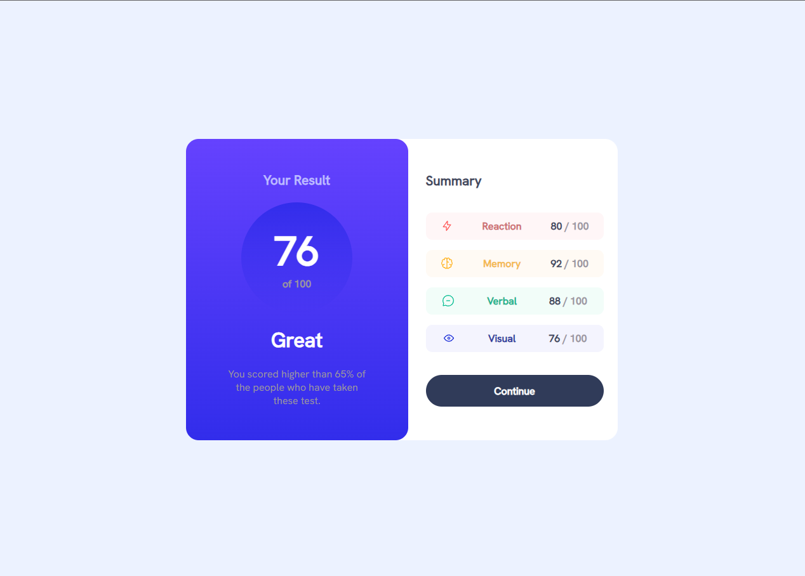
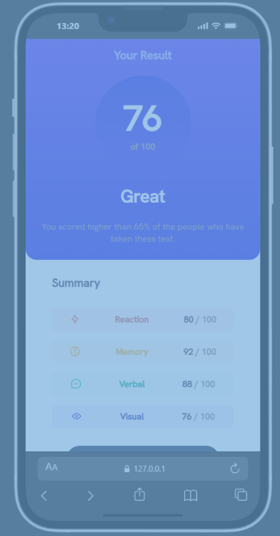

# Frontend Mentor - Results summary component

Esta é uma solução para o [desafio do componente de resumo de resultados no Frontend Mentor](https://www.frontendmentor.io/challenges/results-summary-component-CE_K6s0maV). Os desafios do Frontend Mentor ajudam você a melhorar suas habilidades de codificação construindo projetos realistas.

## Sumário

- [Visão Geral](#visão-geral)
  - [Sobre o desafio](#sobre-o-desafio)
  - [Screenshot](#screenshot)
  - [Links](#links)
- [Meu processo](#meu-processo)
  - [Conteúdo aprendido e trabalhado](#conteúdo-aprendido-e-trabalhado)
  - [Tecnologias utilizadas](#tecnologias-utilizadas)
- [Autor](#autor)

## Visão Geral

### Sobre o desafio

O desafio consiste em construir um componente de resumo de resultados e deixá-lo o mais próximo possível do design original.

Os usuários devem ser capazes de:
- Visualizar o layout ideal para a interface, dependendo do tamanho da tela do dispositivo.
- Ver os estados de hover e foco para todos os elementos interativos na página.

### Screenshot

#### Desktop

#### Mobile

### Links

- Link do Desafio: [Frontend Mentor](https://www.frontendmentor.io/challenges/results-summary-component-CE_K6s0maV)
- Live Project: [Live Project](https://mmdros.github.io/results-summary-component-challenge/)

## Meu processo

### Conteúdo aprendido e trabalhado

Durante o desenvolvimento deste desafio, foquei em organizar o CSS de forma modular e utilizar recursos modernos do CSS3:

- **Variáveis CSS (Custom Properties):** Utilizadas para gerenciar cores e fontes de forma centralizada em `variables.css`, facilitando a manutenção.
- **Flexbox Layout:** Essencial para o alinhamento central do componente e para a organização interna das seções `hero` e `features`.
- **Design Responsivo:** Implementação de `@media queries` para garantir que o componente se adapte perfeitamente de dispositivos móveis a desktops, alterando a direção do fluxo do flexbox de coluna para linha.
- **Estilização de Gradientes:** Uso de `linear-gradient` para criar o efeito visual de profundidade no círculo de pontuação e no fundo da seção de destaque.
- **Organização de Arquivos:** Separação de responsabilidades em múltiplos arquivos CSS (`reset.css`, `variables.css`, `base.css`, `global.css`) para um código mais limpo e escalável.

### Tecnologias utilizadas

- HTML5 Semântico
- CSS3 (Variáveis, Flexbox, Media Queries)
- Mobile-first workflow
- Fontes externas (Hanken Grotesk)

## Autor

- Frontend Mentor - [@seu-usuario](https://www.frontendmentor.io/profile/seu-usuario)
- LinkedIn - [Seu Nome](https://www.linkedin.com/in/seu-perfil)
